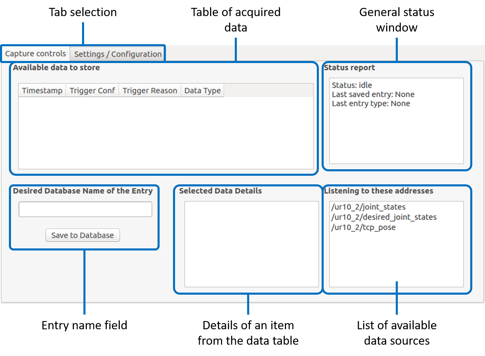

# Helping Hand Graphical User Interface

## tl;dr
A GUI to help with the acquisition of robot skills.

## Longer explanation

This GUI is meant to help out storing data acquired from kinesthetic teaching of robot skills into a database (`mongodb_store`). 

In order to work, the GUI needs a configuration that tells it which topic (of type `std_msgs/Bool`) trigger a save event. This is configured in a `YAML` file. This allows the user to have custom signals that trigger custom save events.

 When the event is triggered, the relevant data is shown in the `Table of acquired

# Using the GUI

The GUI has two tabs: the `Capture controls` and `Setting/Configuration` tab. 

See images bellow




## Configuration

Configuring the signals that trigger a save event is done by editing the file `conf/triggers_conf.yml`. The fields that have to be filled are:
```
example_config:
    trig_name: "<Name of the configuration>"
    robot_ns: "<Robot's namespace>"
    trig_topic: "<Topic of type std_msgs/Bool>"
    trig_type: "<rising_edge, falling_edge or hold>"
    trig_value: true/false 
    trig_callback: "<joint_save, joint_pose_save, joint_dmp_save or cart_dmp_save>"
    joint_topic: "<Needed in every case where joints are saved>"
```
Some configuration require extra entries. For example, if we are capturing a trajectory that will be encoded in a DMP, we also need to specify how many weights will be used  for the encoding `joint_dmp_N`.

In the following we will provide examples for different saving strategies. We will assume the robot's namespace is `/ur10_1/` and that a physical button is linked to a topic of type `std_msgs/Bool` broadcasting on the address `/button_a`.

### Saving joint configurations

```
joint_capture_conf:
    trig_name: "UR10 Button A JOINT"
    robot_ns: "/ur10_1/"
    trig_topic: "/button_a"
    trig_type: "rising_edge"
    trig_value: true
    trig_callback: "joint_save"
    joint_topic: "joint_states"
```
### Saving pose condfigurations
```
pose_capture_conf:
    trig_name: "UR10 Button A MIX"
    robot_ns: "/ur10_1/"
    trig_topic: "/button_a"
    trig_type: "falling_edge"
    trig_value: true
    trig_callback: "joint_pose_save"
    joint_topic: "joint_states"
```
### Saving joint DMP configuration
```
joint_dmp_conf:
    trig_name: "UR10 Button A DMP"
    robot_ns: "/ur10_1/"
    trig_topic: "/button_a"
    trig_type: "hold"
    trig_value: true
    trig_callback: "joint_dmp_save"
    joint_dmp_N: 50
    joint_topic: "joint_states"
```

### Saving cart DMP configuration

Work in progress.

## Usage
When a trigger is detected that was registered in the configuration, a new data sample will be visible. The data can be saved into the MongoDB by first clicking on the item in the table. Then, we can input the desired name of the entry. This is the name of the entry in the database. Used to retrive  this data later. After the name field is filled, we can press the `Save to Database` button and the item will be saved.